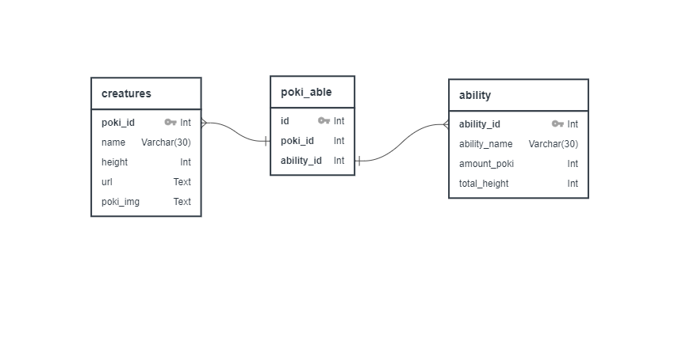

# Pokeweb! A Pokemon Illustrated Book
[Pokemon](https://en.wikipedia.org/wiki/Pok%C3%A9mon) are animals living in different dimension with special abilities.
Pokeweb displays all the Pokemon, Pokemon abilities and their images. All the data comes from [Pokemon API](https://pokeapi.co)

---
### :japanese_ogre:App demo
* Pokeweb is a RWD website.

### :japanese_ogre:Setup

0. [Clone this repository](https://docs.github.com/en/free-pro-team@latest/github/creating-cloning-and-archiving-repositories/cloning-a-repository)

- [x] data_crawling package

1.  Install [Python3](https://www.python.org/download/releases/3.0/)
2.  Initialize a virtualenv to manage all required packages: `pip install pipenv`,`pipenv shell`
3.  Install all required packages based on `Pipfile`:`pipenv install`

* Open your terminal, make sure the path is in `data_crawling` package.
* If you want to print out `creature` and `poki_able` tables: Run the code `print_csv(result[0])`,`print_csv_able(result[1])` at line `112` and `113`. 
* If you want to print out `ability` table: Run the code `print_csv_ability(all_ability_data)` at line `132`.
* Download pokemon images: Run the code `img_crawler() ` at line `156`.

- [x] client and server packages

1. Install [Node.js](https://nodejs.org/en/download/)
2. `npm install` to install all required packages.

* Open your terminal, make sure the path is in `server` package.
    1. Connect to port `localhost:5000` and Postgresql database: Create a [.env](https://medium.com/the-node-js-collection/making-your-node-js-work-everywhere-with-environment-variables-2da8cdf6e786) file and add `USER`,`PASSWORD`,`HOST` and `PORT` variables, also add `DATABASE` variable for your database name and set `SERVER_PORT`variable as `5000`  in the file.
    2. Type `npm run start` in your terminal to start back-end serving.
    3. If you want to add `amount_poki` and `total_height` data to database: Run the functions `update_amount_poki()` and `update_total_height_ability()` in `execute.js`.

* Open another terminal, make sure the path is in `client` package.
    1. Type `npm start` in your terminal to start port `localhost:3000`
    3. you will see the website.

---
### :japanese_ogre:Used modules, technologies and concepts
* Front-end: React.js, Bootstrap4, JS, CSS, HTML
* Data-scraping/data organized: Python, python-dotenv, Pandas
* Back-end and database: Nodejs, Express, node-postgres, Postgresql, dotenv
